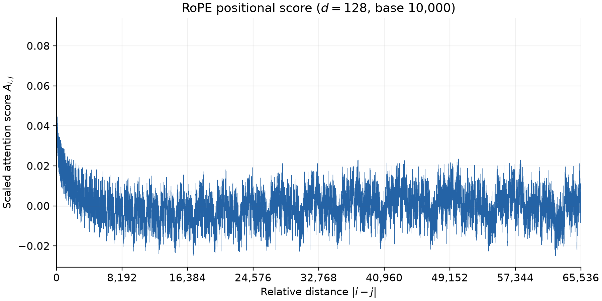
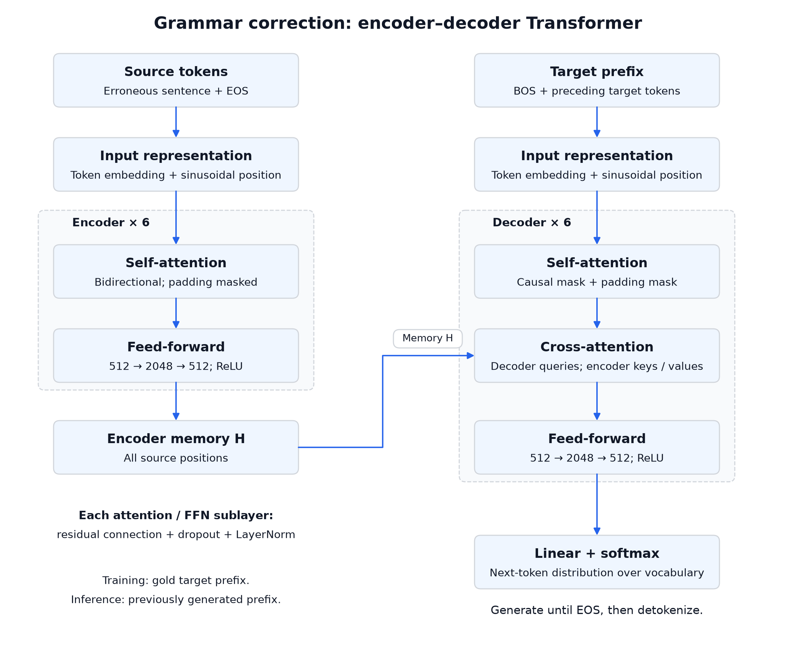

# CS6180 Homework 1

Name: Jingyi Fu

GitHub: [Gingobell/cs6180-hw1](https://github.com/Gingobell/cs6180-hw1)

## 1

### 1.1

$$n_{\mathrm{out}}=\left\lfloor\frac{4-3}{1}\right\rfloor+1=2.$$

The output feature map is $\boxed{2\times2}$.

### 1.2

Let $X=(x_{ij})$ be the input and $K=(k_{ab})$ the filter.
There are four valid $3\times3$ patches. Flatten each patch in row-major order
and use it as a column of $P=\operatorname{im2col}(X)\in\mathbb{R}^{9\times4}$.
The columns correspond to output positions $(1,1),(1,2),(2,1),(2,2)$:

$$P=\begin{bmatrix}
x_{11}&x_{12}&x_{21}&x_{22}\\
x_{12}&x_{13}&x_{22}&x_{23}\\
x_{13}&x_{14}&x_{23}&x_{24}\\
x_{21}&x_{22}&x_{31}&x_{32}\\
x_{22}&x_{23}&x_{32}&x_{33}\\
x_{23}&x_{24}&x_{33}&x_{34}\\
x_{31}&x_{32}&x_{41}&x_{42}\\
x_{32}&x_{33}&x_{42}&x_{43}\\
x_{33}&x_{34}&x_{43}&x_{44}
\end{bmatrix}.$$

Flatten the filter in the same order:

$$w=\begin{bmatrix}k_{11}&k_{12}&k_{13}&k_{21}&k_{22}&k_{23}&k_{31}&k_{32}&k_{33}\end{bmatrix}^{T}.$$

Then the entire convolution is

$$\boxed{\begin{bmatrix}y_{11}&y_{12}&y_{21}&y_{22}\end{bmatrix}=w^TP.}$$

The dimensions are $(1\times9)(9\times4)=1\times4$; reshape the result into
a $2\times2$ feature map.

This matrix form allows GPU-optimized matrix multiplication to exploit parallel
computation and data reuse across patches and filters.

### 1.3

Using the unflipped-filter convention,

$$Y_{ij}=\sum_{a=1}^{3}\sum_{b=1}^{3}k_{ab}x_{i+a-1,j+b-1}.$$

By the chain rule, for $u,v\in\{1,2,3,4\}$,

$$\frac{\partial L}{\partial x_{uv}}
=\sum_{i=1}^{2}\sum_{j=1}^{2}G_{ij}\frac{\partial Y_{ij}}{\partial x_{uv}}
=\boxed{\sum_{a=1}^{3}\sum_{b=1}^{3}k_{ab}G_{u-a+1,v-b+1}},$$

where $G_{ij}=0$ outside $i,j\in\{1,2\}$. The resulting input gradient is
$4\times4$; contributions from overlapping windows are summed.

## 2

### 2.1

Use the RoPE frequencies $\omega_n=10000^{-2n/128}$ for $n=0,\ldots,63$.
Here $A_{i,j}$ denotes the scaled attention score before softmax:

$$A_{i,j}=\frac{(R_iq_i)^T(R_jk_j)}{\sqrt{128}}.$$

For each coordinate pair, let $u=(1,1)^T/\sqrt{128}$ and

$$R(\theta)=\begin{bmatrix}\cos\theta&-\sin\theta\\
\sin\theta&\cos\theta\end{bmatrix}.$$

Since $R(i\omega_n)^TR(j\omega_n)=R((j-i)\omega_n)$, the contribution of
this pair to the dot product is

$$u^TR((j-i)\omega_n)u
=\frac{1}{128}(2\cos((j-i)\omega_n))
=\frac{1}{64}\cos((j-i)\omega_n).$$

Summing over the 64 pairs and using the evenness of cosine gives, for
$\Delta=|i-j|$,

$$\boxed{A_{i,j}=A(\Delta)=\frac{1}{64\sqrt{128}}
\sum_{n=0}^{63}\cos\!\left(\Delta\,10000^{-n/64}\right).}$$

In particular, $A(0)=1/\sqrt{128}\approx0.0883883$.

### 2.2

The curve includes all 65,537 integer distances and is generated by
`scripts/plot_rope.py`.

### 2.3

The score initially tends to decrease with distance, but it is not monotonic:
it oscillates and rises again at some large distances. Each coordinate pair
rotates periodically, so distant positions can regain a high similarity.
Thus RoPE's positional preference for nearby tokens becomes unreliable over
long distances, and using it beyond the training context does not guarantee
reliable attention. The plot does not establish a sharp maximum context length.

Two mitigation strategies are:

- **Position interpolation:** for an extension factor $s=L_{\mathrm{new}}/L_{\mathrm{train}}$,
  use positions $i/s$ so the extended sequence fits within the original
  positional range, then fine-tune on longer sequences.
  ([Chen et al., 2023](https://arxiv.org/abs/2306.15595))
- **Frequency-dependent scaling:** methods such as YaRN scale different
  frequency bands differently to balance local resolution and longer-range
  position coverage, together with long-context fine-tuning.
  ([Peng et al., 2023](https://arxiv.org/abs/2309.00071))

## 3

### 3.1

I would use an encoder–decoder Transformer to model the conditional probability
of a corrected sentence given an erroneous sentence. The encoder can use both
left and right context to identify errors, while the autoregressive decoder can
produce a correction of a different length. The design follows the
[Transformer architecture](https://arxiv.org/abs/1706.03762), with the following
configuration for this task.

**Tokenization and input representation.** I would train a shared byte-level
BPE tokenizer with a vocabulary of approximately 32,000 tokens on the training
split only, preserving capitalization and punctuation. The vocabulary includes
BOS, EOS and PAD. Source and target sequences use a shared embedding matrix
$E\in\mathbb{R}^{V\times512}$. At position $p$, the input is
$\sqrt{512}E[t_p]+\mathrm{PE}(p)$, followed by dropout, where

$$\mathrm{PE}(p,2r)=\sin(p/10000^{2r/512}),\qquad
\mathrm{PE}(p,2r+1)=\cos(p/10000^{2r/512}),\quad r=0,\ldots,255.$$

**Encoder.** Six independently parameterized blocks each contain multi-head
self-attention followed by a position-wise feed-forward network. Each of the
eight attention heads uses 64-dimensional queries, keys and values. For a head,

$$\mathrm{Attention}(Q,K,V)
=\mathrm{softmax}\!\left(\frac{QK^T}{\sqrt{64}}+M\right)V,$$

where the softmax operates over key positions. The mask $M$ is zero at allowed
positions and $-\infty$ at padding positions. The encoder has no causal mask:
every real source token can attend to the entire source sentence. The eight
head outputs are concatenated and projected back to 512 dimensions. The
feed-forward network applies the same transformation independently at each
position:

$$\mathrm{FFN}(h)=\mathrm{ReLU}(hW_1+b_1)W_2+b_2,$$

with $W_1\in\mathbb{R}^{512\times2048}$ and
$W_2\in\mathbb{R}^{2048\times512}$. Each sublayer uses
$\mathrm{LayerNorm}(h+\mathrm{Dropout}(\mathrm{Sublayer}(h)))$.
The final encoder output $H\in\mathbb{R}^{n\times512}$ represents the source.

**Decoder.** Six independently parameterized blocks each contain masked
self-attention, encoder–decoder cross-attention, and a feed-forward network.
Masked self-attention additionally excludes future target positions. In
cross-attention, queries come from the decoder, while keys and values are
projections of $H$; source padding is masked. Thus each generated token can
use both its generated prefix and the full source sentence. Head dimensions,
feed-forward dimensions, residual connections and normalization match the
encoder. Each sublayer has its own parameters.

**Output layer.** A linear projection maps each decoder state $h_t$ to $V$
logits, followed by softmax:

$$p_\theta(y_t\mid y_{<t},x)=\mathrm{softmax}(h_tE^T+b).$$

The output projection shares weights with the token embedding. At inference,
I would start with BOS, repeatedly select the highest-probability next token,
and stop at EOS or a limit of 256 generated tokens, then detokenize the result.

### 3.2

The input is an English sentence that may contain grammatical errors; the
output is the corrected sentence with its intended meaning preserved. For
example, `She go to school every day.` should produce
`She goes to school every day.` Correct sentences should remain unchanged.

I would train on human-corrected sentence pairs $(x,y)$, retaining unchanged
pairs to teach the model when no edit is necessary. I would deduplicate pairs
and split documents into 90% training, 5% validation and 5% test data, keeping
sentences from the same document together. For this sentence-level design,
I would retain examples whose source and target each fit within 256 tokens,
including special tokens, rather than truncate a correction pair midway.

Training would use teacher forcing. If the corrected tokens are
$y_1,\ldots,y_m$, the decoder input is
$[\mathrm{BOS},y_1,\ldots,y_m]$ and the labels are
$[y_1,\ldots,y_m,\mathrm{EOS}]$. The causal mask prevents access to future
labels. All target positions can be trained in parallel. The loss is the
mean negative log-likelihood of non-padding target tokens, including EOS:

$$\mathcal{L}(\theta)=-\frac{1}{N}
\sum_{b=1}^{B}\sum_{t=1}^{T_b}
\log p_\theta(y_t^{(b)}\mid y_{<t}^{(b)},x^{(b)}),\qquad
N=\sum_{b=1}^{B}T_b.$$

Here $T_b$ includes the EOS label and excludes padding. Gradients propagate
through the decoder, cross-attention and encoder to train the complete model.

I would start with the following training settings:

| Setting | Choice |
|---|---|
| Initialization | Random initialization; train all parameters |
| Optimizer | AdamW, $\beta_1=0.9$, $\beta_2=0.999$, $\epsilon=10^{-8}$ |
| Weight decay | 0.01 on weight matrices; none on biases or LayerNorm parameters |
| Learning rate | Linear warmup to $3\times10^{-4}$ over 1,000 updates, then cosine decay to $3\times10^{-5}$ by update 20,000 |
| Batch size | Effective batch of 64 sentence pairs; accumulate gradients if needed |
| Dropout | 0.1 on embeddings, attention weights and sublayer outputs |
| Gradient clipping | Global gradient norm limited to 1.0 |
| Training budget | At most 20,000 optimizer updates, reshuffling training data each epoch |
| Validation | Every 500 updates with dropout disabled; save the lowest-validation-loss checkpoint |
| Early stopping | Stop after five consecutive validation checks without a lower loss |
| Random seed | 1337 |

I would select settings using validation data, then evaluate the selected
checkpoint once on the held-out test set. Alongside token loss, I would inspect
generated corrections for grammatical accuracy, meaning preservation and
unnecessary changes to already-correct text.

## 4

### 4.1

The baseline uses nanoGPT commit
`3adf61e154c3fe3fca428ad6bc3818b27a3b8291` and the Shakespeare character-level
configuration: 6 layers, 6 attention heads, embedding dimension 384,
context length 256, batch size 64, dropout 0.2, and no linear or normalization
biases. The 65-character vocabulary is shared across the 90% training and 10%
validation split, following the upstream preparation script.

The execution environment is a Tesla V100-SXM2-32GB GPU with Python 3.10.16,
PyTorch 2.5.1 and CUDA 12.1. All six runs use float32 with compilation disabled.

Each experiment is configured for seed 1337 and exactly 5,000 optimizer
updates. AdamW uses $(\beta_1,\beta_2)=(0.9,0.99)$, weight decay 0.1 and
gradient clipping at 1.0. The learning rate warms up over 100 updates to
$10^{-3}$ and follows cosine decay toward $10^{-4}$. Each modification is
applied independently to the baseline. Data sampling uses a separate fixed
random generator, and every evaluation uses the same 200 batches per split.

### 4.2

The baseline uses **pre-LayerNorm**:

$$h'=h+\mathrm{Attention}(\mathrm{LN}(h)),\qquad
h''=h'+\mathrm{MLP}(\mathrm{LN}(h')).$$

It also applies a final LayerNorm before the output projection. The RMSNorm
variant replaces all of these normalization layers with

$$\mathrm{RMSNorm}(x)_i=
\gamma_i\frac{x_i}{\sqrt{\frac{1}{d}\sum_{j=1}^{d}x_j^2+10^{-5}}}.$$

This removes mean subtraction while retaining the learned scale. Residual
placement and all other architecture choices stay fixed.
([Zhang and Sennrich, 2019](https://arxiv.org/abs/1910.07467))

### 4.3

The baseline MLP uses **GELU**, with hidden width $4d=1536$.
The SwiGLU replacement is

$$\mathrm{MLP}(x)=\left[\mathrm{SiLU}(xW_g)\odot(xW_u)\right]W_d,$$

followed by the same output dropout. With no biases, the original MLP has
$2d(4d)=8d^2$ parameters, whereas SwiGLU has $3dm$. Choosing
$m=8d/3=1024$ makes the parameter counts exactly equal:
$1,179,648$ per MLP at $d=384$.
([Shazeer, 2020](https://arxiv.org/abs/2002.05202))

### 4.4

The baseline adds **learned absolute positional embeddings** to token
embeddings before the Transformer blocks.

- **NoPE:** remove that embedding table and pass token embeddings directly
  through the existing input dropout. Causal attention masks remain in place.
- **RoPE:** remove the learned position table and rotate query and key pairs
  in every attention layer. Each head has dimension 64, so pair $r$ at position
  $p$ uses angle $p\,10000^{-2r/64}$, for $r=0,\ldots,31$. Values are not rotated.
  The attention scale remains $1/\sqrt{64}$.

Each variant removes $256\times384=98,304$ learned position parameters.

### 4.5

The baseline has 6 query heads and 6 key/value heads. The GQA variant keeps
6 query heads but uses 3 key heads and 3 value heads. With zero-based indexing,
query head $h$ uses key/value head $\lfloor h/2\rfloor$:

$$O_h=\mathrm{softmax}\!\left(
\frac{Q_hK_{\lfloor h/2\rfloor}^{T}}{\sqrt{64}}+M
\right)V_{\lfloor h/2\rfloor}.$$

Thus query heads $(0,1)$, $(2,3)$ and $(4,5)$ share three respective key/value
pairs. The joint projection output width decreases from $3(384)=1152$ to
$384+2(3\times64)=768$; the output projection and learned absolute positional
embeddings remain unchanged. The implementation repeats the projected K/V
heads for attention computation, so it implements parameter sharing without
claiming an optimized grouped-attention memory footprint.
([Ainslie et al., 2023](https://arxiv.org/abs/2305.13245))

Total trainable parameter counts, counting tied token/output weights once:

| Model | Parameters |
|---|---:|
| Baseline | 10,745,088 |
| RMSNorm | 10,745,088 |
| SwiGLU | 10,745,088 |
| NoPE | 10,646,784 |
| RoPE | 10,646,784 |
| GQA | 9,860,352 |
